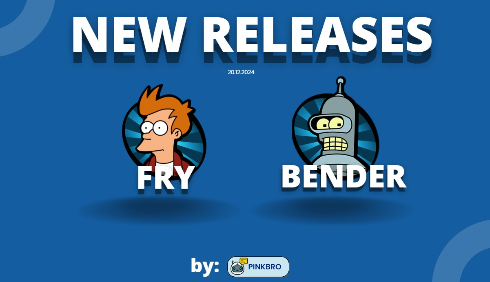

# Construcción de un sistema Retrieval-Augmented Generation (E2E)

Este proyecto está diseñado para responder preguntas sobre la industria alimenticia utilizando documentos oficiales del gobierno de los Estados Unidos (USA). Es un proyecto RAG (Retrieval-Augmented Generation) que combina técnicas avanzadas como procesamiento de texto, embeddings y almacenamiento vectorial para extraer y generar respuestas precisas basadas en los datos proporcionados. Además, se encuentra desarrollado siguiendo una estructura escalable, optimizada para su implementación en entornos de producción.

## Descripción general:

**Carpetas principales:**

### Carpetas principales:

- **`data/`**: Directorio para almacenar datos relacionados con el proyecto. Se puede usar para entradas o salidas de procesamiento.

- **`src/`**: Contiene el código fuente principal.
  - **`backgroud/`**:
    - `bgstyle.py`: Cambia estilos de fondo dinámicamente en Streamlit..
    - `streamlit_ui.py`: Gestión completa de interfaz y modelo RAG Streamlit.
  - **`chunking/`**:
    - `chunking.py`: Divisor de texto en fragmentos manejables.
  - **`embedding/`**:
    - `embedding.py`: Calculador de embeddings basado en el modelo configurado.
  - **`evaluation/`**:
    - `evaluation.py`: "Evaluación automatizada de QA y RAG en Streamlit.
  - **`loaders/`**:
    - `loaders.py`: Cargador y procesador de archivos PDF.
  - **`retrievers/`**:
    - `rag_retriever.py`: Implementación de un sistema de recuperación para cadenas RAG.
  - **`vector_store_client/`**:
    - `vector_store_client.py`: Manejo general de operaciones con almacenamiento de vectores.


**Archivos principales:**
-	**`main.py`**: Archivo principal para ejecutar la aplicación.
-	**`requirements.txt`**: Lista de dependencias necesarias para ejecutar el proyecto.

## Instrucciones para ejecución (se recomienda el uso de Python 3.11.0):
**Instalación**
1.	Clona este repositorio:
```bash
   git clone https://github.com/matiastzara/practicos-rag.git
```
2. Crea un entorno virtual en tu computador:
```bash
    python -m venv .venv
```
3. Activa el entorno virtual:
```bash
    # On Mac
    source .venv/bin/activate
    # On Windows
    .venv\Scripts\activate
```
4. Instala las dependencias:
```bash
    pip install -r requirements.txt
```
**Uso:**
1.	Ejecuta el código principal utilizando:
```bash
streamlit run main.py
```
Se abrirá una interfaz para que puedas interactuar con el modelo. Luego, puedes realizar tus preguntas en la parte inferior.


## Método de Retrieval utilizado:

Para este trabajo utilizamos el método Hybrid Search aplicado en el modelo Super:
La idea principal es combinar diversas técnicas de búsqueda en un ensamble, que típicamente incluye la búsqueda basada en palabras clave y la búsqueda semántica (vectorial). Esta combinación permite aprovechar la precisión de las búsquedas basadas en palabras clave, que son efectivas para localizar coincidencias exactas o términos específicos, junto con la capacidad de las búsquedas semánticas para comprender y procesar el significado o el contexto de las consultas, ofreciendo resultados más relevantes y contextuales que pueden no coincidir exactamente con las palabras clave ingresadas pero son relevantes para la intención del usuario.


## Benchmark y Comparación de Resultados:

### Comparación de métricas entre la el modelo incial (naive) y el modelo con un retrieval avanzado (super)

| RAG                | Naive | Super |
|--------------------|-------|-------|
| Threshold          | 0.3   | 0.3   |
| Temperature        | 0.5   | 0.5   |
| Buffer             | 2     | 2     |
| Context precision  | 7%    | 24%   |
| Context recall     | 6%    | 6%    |
| Faithfulness       | 81%   | 91%   |
| Answer relevancy   | 92%   | 95%   |


### Comparación de preguntas:

| Pregunta                                                                                                                                             | Original                                                                                                                                                                                                                                                                                                                                                                                                                                                                                    | Super                                                                                                                                                                                                                                                                                                                                                                                                                                                                                                                                       | Naive                                                                                                                                                                                                                                                                                                                                                                                                                                                                                                                                       |
|------------------------------------------------------------------------------------------------------------------------------------------------------|---------------------------------------------------------------------------------------------------------------------------------------------------------------------------------------------------------------------------------------------------------------------------------------------------------------------------------------------------------------------------------------------------------------------------------------------------------------------------------------------|---------------------------------------------------------------------------------------------------------------------------------------------------------------------------------------------------------------------------------------------------------------------------------------------------------------------------------------------------------------------------------------------------------------------------------------------------------------------------------------------------------------------------------------------|--------------------------------------------------------------------------------------------------------------------------------------------------------------------------------------------------------------------------------------------------------------------------------------------------------------------------------------------------------------------------------------------------------------------------------------------------------------------------------------------------------------------------------------------|
| What must an establishment maintain documentation of if operating under the terms of an exemption or alternative?                                   | A grant of the exemption or alternative, and the date on which they began operating under the terms of the exemption or alternative. The Director may grant an exemption or alternative if it aligns with the goals of protecting public health and preventing the spread of communicable diseases.                                                                                                                                                                                         | An establishment operating under the terms of an exemption or alternative must maintain documentation of FDA’s grant of the exemption or alternative, as well as the date on which they began operating under those terms. The Director may grant an exemption or alternative if it is consistent with protecting public health and preventing the spread of communicable diseases. Establishments must not begin operating under the terms of the exemption or alternative until it has been granted.                 | An establishment operating under the terms of an exemption or alternative must maintain documentation of FDA’s grant of the exemption or alternative, including the date operations began under those terms. This requirement is aligned with the goals of protecting public health and preventing disease spread. The establishment cannot operate under exemption or alternative terms until granted.                                                                                                                                                                     |
| What is the definition of "possession" as stated in §1240.10 of the Food and Drug Administration regulations?                                        | Any of the possessions of the United States, including Puerto Rico and the Virgin Islands.                                                                                                                                                                                                                                                                                                                                                                                                 | The definition of “possession” as stated in §1240.10 of the Food and Drug Administration regulations refers to any of the possessions of the United States, such as Puerto Rico and the Virgin Islands. The regulations also define potable water, state, utensils, vessels, and shellfish. The specific definitions provided in the regulations are important for understanding and compliance with food and drug safety standards.                                                                   | The definition of "possession" in §1240.10 includes any US possessions like Puerto Rico and the Virgin Islands. These terms are part of broader FDA regulatory standards covering related definitions such as potable water, state, utensils, vessels, and shellfish. Understanding these definitions is crucial for compliance with FDA standards.                                                                                                                                                                                        |
| What must the importer of record do when an HCT/P is offered for import?                                                                             | The importer of record must notify the FDA before or at the time of importation.                                                                                                                                                                                                                                                                                                                                                                                                             | When an HCT/P is offered for import, the importer of record must notify the director of the FDA district at the port of entry and provide sufficient information for an admissibility decision. The HCT/P must be held intact by the importer or consignee under conditions necessary to prevent the transmission of communicable disease until an admissibility decision is made by the FDA. It is essential for the importer of record to follow these procedures when importing an HCT/P.                                               | When an HCT/P is offered for import, the importer of record must notify the FDA district director at the port of entry and provide sufficient information for an admissibility decision. The HCT/P must be held intact by the importer or consignee under conditions preventing disease transmission until an admissibility decision is made by the FDA. The importer of record will be notified by FDA once a decision regarding the admissibility of the HCT/P is made.                                                                                                  |
| When must a new specimen be collected from anonymous semen donors and tested for infection?                                                          | must be collected and tested for evidence of infection due to communicable disease agents.                                                                                                                                                                                                                                                                                                                                                                                                  | A new specimen from anonymous semen donors must be collected at least 6 months after the date of donation and tested for infection due to communicable disease agents. This retesting requirement applies to anonymous donors, with exceptions for directed reproductive donors. The timing and testing for infection must be done in accordance with FDA regulations to reduce the risk of transmission of relevant communicable diseases.                                                                  | A new specimen from anonymous semen donors must be collected and tested for infection at least 6 months after the donation date, aligning with regulations. Testing is required for evidence of infection due to communicable disease agents specified in the section. Exceptions may apply for directed reproductive donors and other specific situations.                                                                                                                                                                                            |


## Presentación 

[Link de presentación](https://www.canva.com/design/DAGZyYRidPc/GrfsCdUw9zPo2FziDHVpqQ/edit?utm_content=DAGZyYRidPc&utm_campaign=designshare&utm_medium=link2&utm_source=sharebutton)

